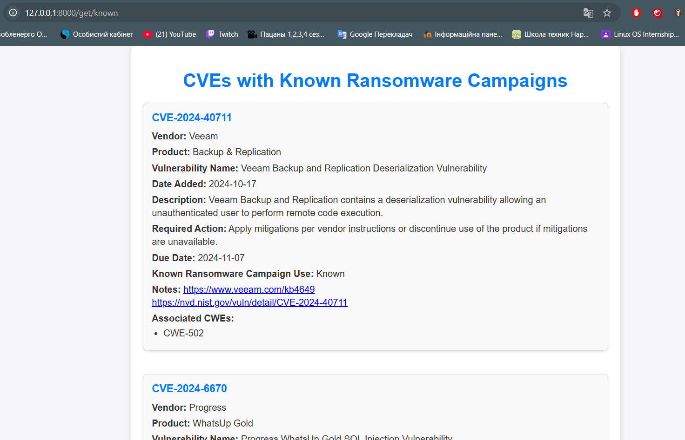

# FastAPI-Application-Part-2

Цей додаток відрізняється від минулої версії, функціоналом зберігання даних в elasticsearch. І в подальшому щоб отримати дані відбуваються звернення саме до бази даних а не напряму з файлу. Файл використовуєтсья при ініціалізації бд. Щоб ініціалізувати базу, потрібно звернутися до endpoint /init-db

**`/init-db`**
   - **Опис**: Ініціалізує базу даних з локального файлу
   - **Вивід**: HTML-сторінка з базовою інформацією про index. Він буде або створений або виведеться повідомлення що його ініціалізовано.

Інші endpoint мають таку саму логіку як у минулому завданні.

## Перелік доступних ендпоінтів крім /init-db:

1. **`/info`**
   - **Опис**: Повертає інформацію про додаток та автора.
   - **Вивід**: HTML-сторінка з базовою інформацією про розробника та функціональність додатка.

2. **`/get/all`**
   - **Опис**: Повертає список CVE, доданих за останні 30 днів (за останні днів 5 знайдено лише 1  cve)
   - **Обмеження**: Виводить максимум 40 CVE.
   - **Вивід**: HTML-сторінка зі списком уразливостей, відсортованих за датою додавання.

3. **`/get/new`**
   - **Опис**: Повертає 10 найновіших CVE.
   - **Вивід**: HTML-сторінка з інформацією про найновіші уразливості.

4. **`/get/known`**
   - **Опис**: Повертає CVE, де поле `knownRansomwareCampaignUse` має значення `Known`.
   - **Обмеження**: Виводить максимум 10 CVE.
   - **Вивід**: HTML-сторінка зі списком відповідних CVE.

5. **`/get?query="key"`**
   - **Опис**: Виконує пошук CVE, які містять ключове слово, передане через параметр `query`.
   - **Параметр**:
     - `query` (обов’язковий): Ключове слово для пошуку.
   - **Вивід**: HTML-сторінка зі списком CVE, що відповідають пошуковому запиту.


Як згадувалося раніше всі запити йдуть до бази даних а не з файлу. Оси приклад запиту з функції,
яка повертає 10 найновіших cve:

```python
query = {
            "query": {
                "match_all": {}
            },
            "sort": [
                {"dateAdded": {"order": "desc"}}
            ],
            "size": 10
        }
```


# Результат виконання

## Ендпоінт `/info`

### Скріншот:


## Ендпоінт `/init-db`

### Скріншот:


## Ендпоінт `/get/all/1`

### Скріншот:


## Ендпоінт `/get/new`

### Скріншот:


## Ендпоінт `/get/known`

### Скріншот:



## Ендпоінт `/get?qeury`

### Скріншот:


  
